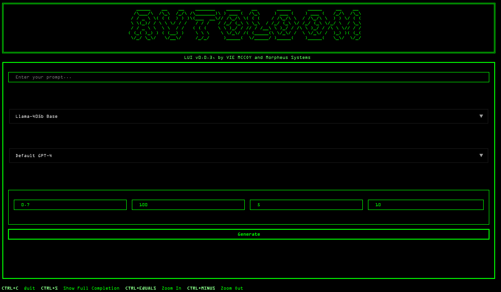

# Autoloom 2

An improved version of [Autoloom](https://github.com/viemccoy/autoloom), with edits by Cassandra Melax.

*Original Autoloom interface (LUI v0.0.3), by Vie McCoy and Morpheus Systems.*

## Version 2 edits

Version 2 builds on the original with improvements to context handling, the terminal interface, and generation error handling:

- **Full sequence context:** subsequent generations receive the original prompt plus the accumulated completions.
- **Compact parameter controls:** labeled fields for temperature, maximum tokens, number of generations, and wait time.
- **Generation retries and timeouts:** model-specific retry limits, exponential backoff, and request timeouts.
- **Classifier configuration:** a default classifier and custom model IDs loaded from environment variables.

## Setup

The project declares Python ^3.8 and uses Poetry for dependency management.

~~~bash
git clone https://github.com/c4554ndr4/autoloom-2.git
cd autoloom-2
poetry install
~~~

Create a .env file in the repository directory:

~~~env
OPENAI_API_KEY=your_openai_api_key_here
HYPERBOLIC_API_KEY=your_hyperbolic_api_key_here
DEFAULT_CLASSIFIER=gpt-4

# Optional custom classifier
CLASSIFIER_MY_CUSTOM_MODEL=your_model_id
~~~

The classifier uses OpenAI; Hyperbolic credentials are needed for Hyperbolic generation. Model IDs in the interface must be available to your provider account.

## Usage

Start the terminal interface:

~~~bash
poetry run lui
~~~

Enter a prompt, choose generation and classifier models, adjust the parameters, and select **Generate**. Autoloom generates a batch, scores the completions, and automatically continues with its selected output after the configured delay.

| Control | Meaning | Default |
| --- | --- | --- |
| T | Generation temperature | 0.7 |
| Tok | Maximum tokens per completion | 100 |
| N | Completions per batch | 5 |
| W | Delay before continuing, in seconds | 10 |

A wait time of 0 continues immediately. Each new round includes the accumulated sequence, subject to the selected model's context limit.

- **Ctrl+S:** view the full completion history.
- **Ctrl+C:** open the quit confirmation.

The repository also includes **TUNI**, a tool for creating human-versus-AI classification datasets:

~~~bash
poetry run tuni
~~~

## Project layout

- **lui/**: terminal interface, generation, and classification.
- **tuni/**: classification dataset tools.
- **tunes/**: dataset files.
- **pyproject.toml**: dependencies and command entry points.

## Feedback

Report problems or suggest improvements through [GitHub issues](https://github.com/c4554ndr4/autoloom-2/issues).
